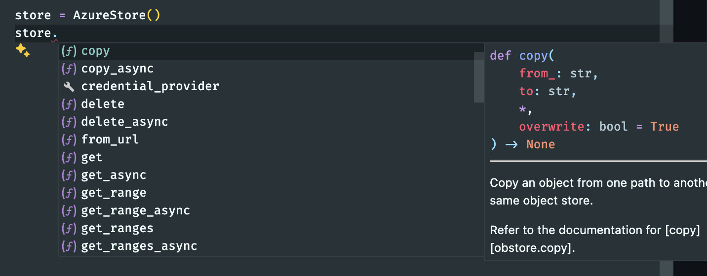
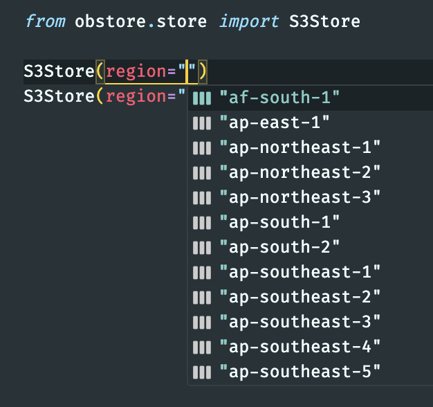
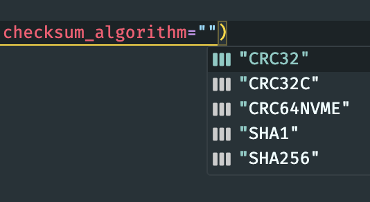

# Releasing obstore 0.5!

Obstore is the simplest, highest-throughput Python interface to Amazon S3, Google Cloud Storage, and Azure Storage, powered by Rust.

This post gives an overview of what's new in obstore version 0.5.

<!-- more -->

Refer to the [changelog](../../CHANGELOG.md) for all updates.

## Class method wrappers

Until now, obstore provided only a _functional_ API with top-level functions exported from the `obstore` module. Now, obstore additionally provides these functions as methods on each store class.

**Previously**:

```py
import obstore as obs
from obstore.store import AzureStore

store = AzureStore()
obs.put(store, ...)
```

**Now**:

```py
from obstore.store import AzureStore

store = AzureStore()
store.put(...) # (1)!
```

1.  Note that this calls the class method `store.put` instead of the module-level function `obstore.put`.

This also can ease understanding of the API, since you can explore available methods from the store object directly.



## Credential providers

Authentication tends to be among the trickiest but most important elements of connecting to object storage. There are many ways to handle credentials, and trying to support every one natively in Obstore demands a high maintenance burden.

Instead, this release supports **custom credential providers**: Python callbacks that allow for full control over credential generation.

We'll dive into a few salient points, but make sure to read the [full authentication documentation](../../authentication.md) in the user guide.

### "Official" SDK credential providers

You can use the [`Boto3CredentialProvider`][obstore.auth.boto3.Boto3CredentialProvider] to use [`boto3.Session`][boto3.session.Session] to handle credentials.

```py
from boto3 import Session
from obstore.auth.boto3 import Boto3CredentialProvider
from obstore.store import S3Store

session = Session(...)
credential_provider = Boto3CredentialProvider(session)
store = S3Store("bucket_name", credential_provider=credential_provider)
```

### Custom credential providers

There's a long tail of possible authentication mechanisms. Obstore allows you to provide your own custom authentication callback.

You can provide either a **synchronous or asynchronous** custom authentication function.

The simplest custom credential provider can be just a function callback:

```py
from datetime import datetime, timedelta, UTC

def get_credentials() -> S3Credential:
    return {
        "access_key_id": "...",
        "secret_access_key": "...",
        # Not always required
        "token": "...",
        "expires_at": datetime.now(UTC) + timedelta(minutes=30),
    }
```

Then just pass that function into `credential_provider`:

```py
S3Store(..., credential_provider=get_credentials)
```

More advanced credential providers, which may need to store state, can be class based. See the [authentication user guide](../../authentication.md) for more information.

### Automatic token refresh

If the credential returned by the credential provider includes an `expires_at` key, obstore will **automatically** call the credential provider to refresh your token before the expiration time.

**Your code doesn't need to think about token expiration times!**

This allows for seamlessly using something like the [AWS Security Token Service (STS)](https://docs.aws.amazon.com/STS/latest/APIReference/welcome.html), which provides temporary token credentials each hour. See [`StsCredentialProvider`][obstore.auth.boto3.StsCredentialProvider] for an example of a credential provider that uses [`STS.Client.assume_role`][] to automatically refresh tokens.

## Improved Fsspec integration

This release also significantly improves integration with the [fsspec](https://github.com/fsspec/filesystem_spec) ecosystem.

You can now [register][obstore.fsspec.register] obstore as the default handler for supported protocols, like `s3`, `gs`, and `az`. Then calling `fsspec.filesystem` or `fsspec.open` will automatically defer to [`obstore.fsspec.FsspecStore`][] and [`obstore.fsspec.BufferedFile`][], respectively.

The fsspec integration is no longer tied to a specific bucket. Instead, [`FsspecStore`][obstore.fsspec.FsspecStore] will automatically handle multiple buckets within a single protocol.

For example, obstore's fsspec integration is now tested as working with [pyarrow](../../examples/pyarrow.md).

For more information, read the [fsspec page in the user guide](../../integrations/fsspec.md).

## Improved AWS type hinting

Type hinting has been improved for AWS enums, for example AWS region. Now, when you're constructing an S3Store, if your editor supports it, you'll receive suggestions based on the type hints.

Here are two examples from vscode:

{: style="height:300px"}
{: style="height:200px"}

## Benchmarking

We've continued work on [benchmarking obstore](https://github.com/geospatial-jeff/pyasyncio-benchmark).

New benchmarks run on an EC2 M5 instance indicate obstore provides [2.8x higher throughput than aioboto3](https://github.com/geospatial-jeff/pyasyncio-benchmark/blob/40e67509a248c5102a6b1608bcb9773295691213/test_results/20250218_results/ec2_m5/aggregated_results.csv) when fetching the first 16KB of a file many times from an async context.

## Improved documentation

- [fsspec documentation](../../integrations/fsspec.md)
- [pyarrow integration](../../examples/pyarrow.md)
- [authentication documentation](../../authentication.md)

## All updates

Refer to the [changelog](../../CHANGELOG.md) for all updates.
