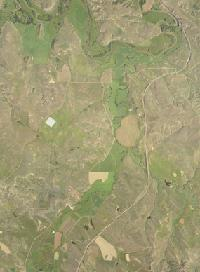

# Releasing obstore 0.6!

Obstore is the simplest, highest-throughput Python interface to Amazon S3, Google Cloud Storage, and Azure Storage, powered by Rust.

This post gives an overview of what's new in obstore version 0.6.

<!-- more -->

Refer to the [changelog](../../CHANGELOG.md) for all updates.

## Easier access to Microsoft Planetary Computer

The [Microsoft Planetary Computer](https://planetarycomputer.microsoft.com/) hosts a multi-petabyte catalog of global environmental data.

The contained data is publicly accessible, but requires the user to fetch [short-lived access tokens](https://planetarycomputer.microsoft.com/docs/concepts/sas/). But accessing and refreshing these tokens every hour can be confusing and annoying.

Following up on the [addition in v0.5 of credential providers](obstore-0.5.md#credential-providers), this release adds [`PlanetaryComputerCredentialProvider`][obstore.auth.planetary_computer.PlanetaryComputerCredentialProvider], which **handles all token access and refresh automatically**.

As a quick example, we'll read data from the [NAIP dataset](https://planetarycomputer.microsoft.com/dataset/naip):

```py
from obstore.store import AzureStore
from obstore.auth.planetary_computer import PlanetaryComputerCredentialProvider

url = "https://naipeuwest.blob.core.windows.net/naip/v002/mt/2023/mt_060cm_2023/"

# Construct an AzureStore with this credential provider.
#
# The account, container, and container prefix are passed down to AzureStore
# automatically.
store = AzureStore(credential_provider=PlanetaryComputerCredentialProvider(url))
```

Then, for example, list some items in the container (the prefix `v002/mt/2023/mt_060cm_2023` was automatically set as the prefix on the `AzureStore`):

```py
items = next(store.list())
print(items[:2])
```

```py
[{'path': '44104/m_4410401_ne_13_060_20230811_20240103.200.jpg',
  'last_modified': datetime.datetime(2025, 1, 13, 18, 18, 1, tzinfo=datetime.timezone.utc),
  'size': 14459,
  'e_tag': '0x8DD33FE9DB7A24D',
  'version': None},
 {'path': '44104/m_4410401_ne_13_060_20230811_20240103.tif',
  'last_modified': datetime.datetime(2025, 1, 13, 16, 39, 6, tzinfo=datetime.timezone.utc),
  'size': 400422790,
  'e_tag': '0x8DD33F0CC1D1752',
  'version': None}]
```

And we can fetch an image thumbnail:

```py
path = "44106/m_4410602_nw_13_060_20230712_20240103.200.jpg"
image_content = store.get(path).bytes()

# Write out the image content to a file in the current directory
with open("thumbnail.jpg", "wb") as f:
    f.write(image_content)
```

And voilà:



### Using with the Planetary Computer STAC API

[STAC](https://stacspec.org/en) is a metadata specification for geospatial data. The Planetary Computer [provides a STAC API](https://planetarycomputer.microsoft.com/docs/quickstarts/reading-stac/) to help search and find data of interest.

The [`PlanetaryComputerCredentialProvider`][obstore.auth.planetary_computer.PlanetaryComputerCredentialProvider] includes a [`from_asset`][obstore.auth.planetary_computer.PlanetaryComputerCredentialProvider].from_asset] constructor to easily convey configuration.

```py
import pystac_client

from obstore.auth.planetary_computer import PlanetaryComputerCredentialProvider
from obstore.store import AzureStore

stac_url = "https://planetarycomputer.microsoft.com/api/stac/v1/"
# Open the STAC Catalog
catalog = pystac_client.Client.open(stac_url)

# Access a specific Collection and Asset
collection = catalog.get_collection("daymet-daily-hi")
asset = collection.assets["zarr-abfs"]

# Then we can pass this directly to `from_asset`
credential_provider = PlanetaryComputerCredentialProvider.from_asset(asset)

# Print objects at the root of this directory
store = AzureStore(credential_provider=credential_provider)
print(store.list_with_delimiter()["objects"])
```

```py
[{'path': '.zattrs',
  'last_modified': datetime.datetime(2021, 6, 9, 15, 48, 6, tzinfo=datetime.timezone.utc),
  'size': 402,
  'e_tag': '0x8D92B5DF9186DED',
  'version': None},
 {'path': '.zgroup',
  'last_modified': datetime.datetime(2021, 6, 9, 15, 45, 56, tzinfo=datetime.timezone.utc),
  'size': 24,
  'e_tag': '0x8D92B5DABDE919A',
  'version': None},
 {'path': '.zmetadata',
  'last_modified': datetime.datetime(2021, 6, 9, 15, 46, 56, tzinfo=datetime.timezone.utc),
  'size': 13479,
  'e_tag': '0x8D92B5DCFE1B7CC',
  'version': None}]
```

## All updates

Refer to the [changelog](../../CHANGELOG.md) for all updates.
