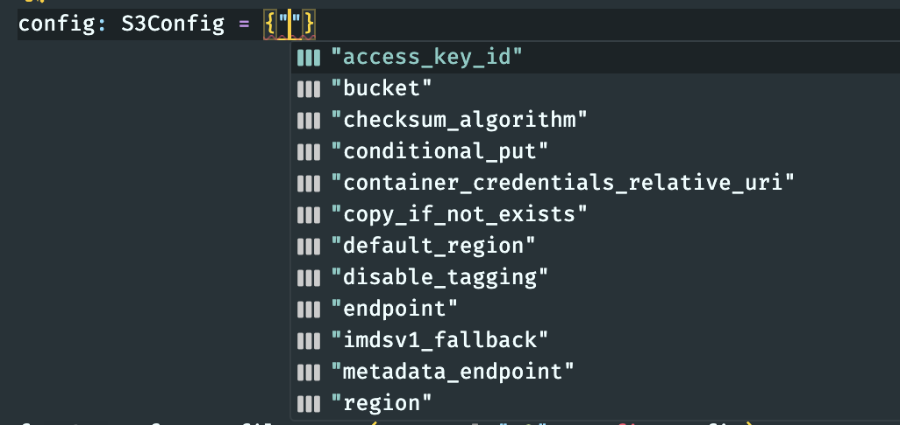

# fsspec Integration

Obstore provides native integration with the [fsspec] ecosystem.

[fsspec]: https://github.com/fsspec/filesystem_spec

The fsspec integration is best effort and may not provide the same
performance as the rest of obstore. Where possible, implementations should use
the underlying `obstore` APIs directly. If you find any bugs with this
integration, please [file an
issue](https://github.com/developmentseed/obstore/issues/new/choose).

## Usage

### Direct class usage

Construct an fsspec-compatible filesystem with [`FsspecStore`][obstore.fsspec.FsspecStore]. This implements [`AbstractFileSystem`][fsspec.spec.AbstractFileSystem], so you can use it wherever an API expects an fsspec-compatible filesystem.

```py
from obstore.fsspec import FsspecStore

fs = FsspecStore("s3", region="us-west-2", skip_signature=True)
prefix = (
    "s3://sentinel-cogs/sentinel-s2-l2a-cogs/12/S/UF/2022/6/S2B_12SUF_20220609_0_L2A/"
)
items = fs.ls(prefix)
# [{'name': 'sentinel-cogs/sentinel-s2-l2a-cogs/12/S/UF/2022/6/S2B_12SUF_20220609_0_L2A/AOT.tif',
#   'size': 80689,
#   'type': 'file',
#   'e_tag': '"c93b0f6b0e2cf8e375968f41161f9df7"'},
#   ...
```

If you need a readable or writable file-like object, you can call the `open`
method provided on `FsspecStore`, or you may construct a
[`BufferedFile`][obstore.fsspec.BufferedFile] directly.

```py
from obstore.fsspec import FsspecStore

fs = FsspecStore("s3", region="us-west-2", skip_signature=True)

with fs.open(
    "s3://sentinel-cogs/sentinel-s2-l2a-cogs/12/S/UF/2022/6/S2B_12SUF_20220609_0_L2A/thumbnail.jpg",
) as file:
    content = file.read()
```

Using the `FsspecStore` class directly may be preferred because the type hinting should work automatically, which may help IDEs like VSCode suggest valid keyword parameters.

### Register as a global handler

Use [`register`][obstore.fsspec.register] to register obstore as the default
handler for various protocols. Then use [`fsspec.filesystem`][] to create an
fsspec filesystem object for a specific protocol. Or use [`fsspec.open`][] to
open a file given a URL.

```py
import fsspec
from obstore.fsspec import register

# Register obstore as the default handler for all protocols supported by
# obstore.
# You may wish to register only specific protocols, instead.
register()

# Create a new fsspec filesystem for the given protocol
fs = fsspec.filesystem("https")
content = fs.cat_file("https://example.com/")

# Or, open the file directly
url = "https://github.com/opengeospatial/geoparquet/raw/refs/heads/main/examples/example.parquet"
with fsspec.open(url) as file:
    content = file.read()
```

## Store configuration

Some stores may require configuration. You may pass configuration parameters to the [`FsspecStore`][obstore.fsspec.FsspecStore] constructor directly. Or, if you're using [`fsspec.filesystem`][], you may pass configuration parameters to that call, which will pass parameters down to the `FsspecStore` constructor internally.

```py
from obstore.fsspec import FsspecStore

fs = FsspecStore("s3", region="us-west-2", skip_signature=True)
```

Or, with [`fsspec.filesystem`][]:

```py
import fsspec

from obstore.fsspec import register

register("s3")

fs = fsspec.filesystem("s3", region="us-west-2", skip_signature=True)
```

## Type hinting

The fsspec API is not conducive to type checking. The easiest way to get type hinting for parameters is to use [`FsspecStore`][obstore.fsspec.FsspecStore] to construct fsspec-compatible stores instead of [`fsspec.filesystem`][].

[`fsspec.open`][] and [`fsspec.filesystem`][] take arbitrary keyword arguments that they pass down to the underlying store, and these pass-through arguments are not typed.

However, it is possible to get type checking of store configuration by defining config parameters as a dictionary:

```py
from __future__ import annotations

from typing import TYPE_CHECKING

import fsspec

from obstore.fsspec import register

if TYPE_CHECKING:
    from obstore.store import S3Config

register("s3")

config: S3Config = {"region": "us-west-2", "skip_signature": True}
fs = fsspec.filesystem("s3", config=config)
```

Then your type checker will validate that the `config` dictionary is compatible with [`S3Config`][obstore.store.S3Config]. VSCode also provides auto suggestions for parameters:



!!! note

    `S3Config` is a "type-only" construct, and so it needs to be imported from within an `if TYPE_CHECKING` block. Additionally, `from __future__ import annotations` must be at the top of the file.
