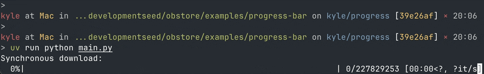

# Obstore progress bar example

Example displaying a progress bar from a streaming response using [`tqdm`](https://tqdm.github.io/).



```shell
uv run python main.py
```

You can also pass an arbitrary URL from the command line for testing:

```shell
uv run python main.py https://ookla-open-data.s3.us-west-2.amazonaws.com/parquet/performance/type=fixed/year=2019/quarter=1/2019-01-01_performance_fixed_tiles.parquet
```
